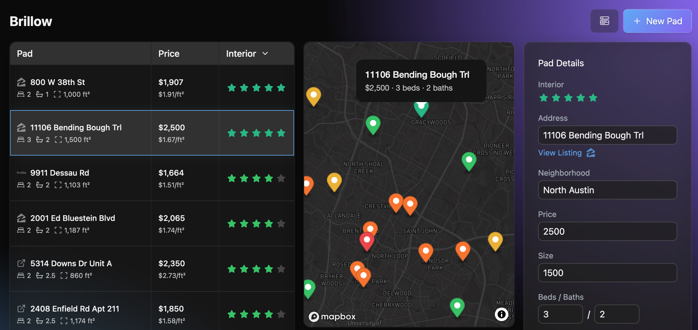

# Brillow

Brillow is a modern house hunting companion that helps you track and compare properties with a beautiful, intuitive interface. Built with glass-morphism design and real-time interactions, it makes managing your house hunting journey a breeze.

## Features

### Core Functionality ✓
- [✓] Interactive property table with real-time editing
- [✓] Property details panel with comprehensive information
- [✓] Interactive map view with property locations
- [✓] 5-star rating system for ranking properties
- [✓] Keyboard navigation (j/k) for quick property browsing

### Data Management ✓
- [✓] Import/Export functionality (CSV)
- [✓] Automatic address geocoding
- [✓] Persistent local storage
- [✓] Source-specific icons (Zillow, Trulia, Facebook, Realtor.com)

### User Interface ✓
- [✓] Modern glass-morphism dark theme
- [✓] Responsive layout with resizable columns
- [✓] Smooth animations and transitions
- [✓] Intuitive dropdown menus
- [✓] Contextual property actions

## Upcoming Features 🚀
- [ ] Advanced filtering and sorting
- [ ] Custom tags and categories
- [ ] Multiple view layouts
- [ ] Comparison mode
- [ ] Cloud sync
- [ ] Mobile optimization

## Tech Stack
- Next.js 14 (App Router)
- React 18 with Server Components
- TypeScript
- Tailwind CSS
- TanStack Table v8
- Zustand for state management
- Mapbox for mapping
- Radix UI for accessible components

## Development
